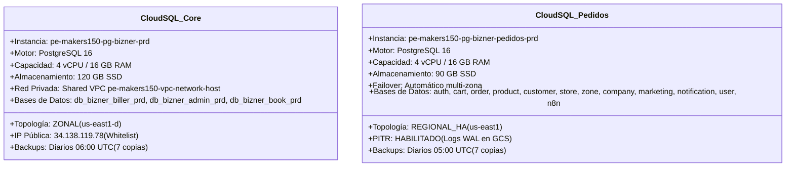
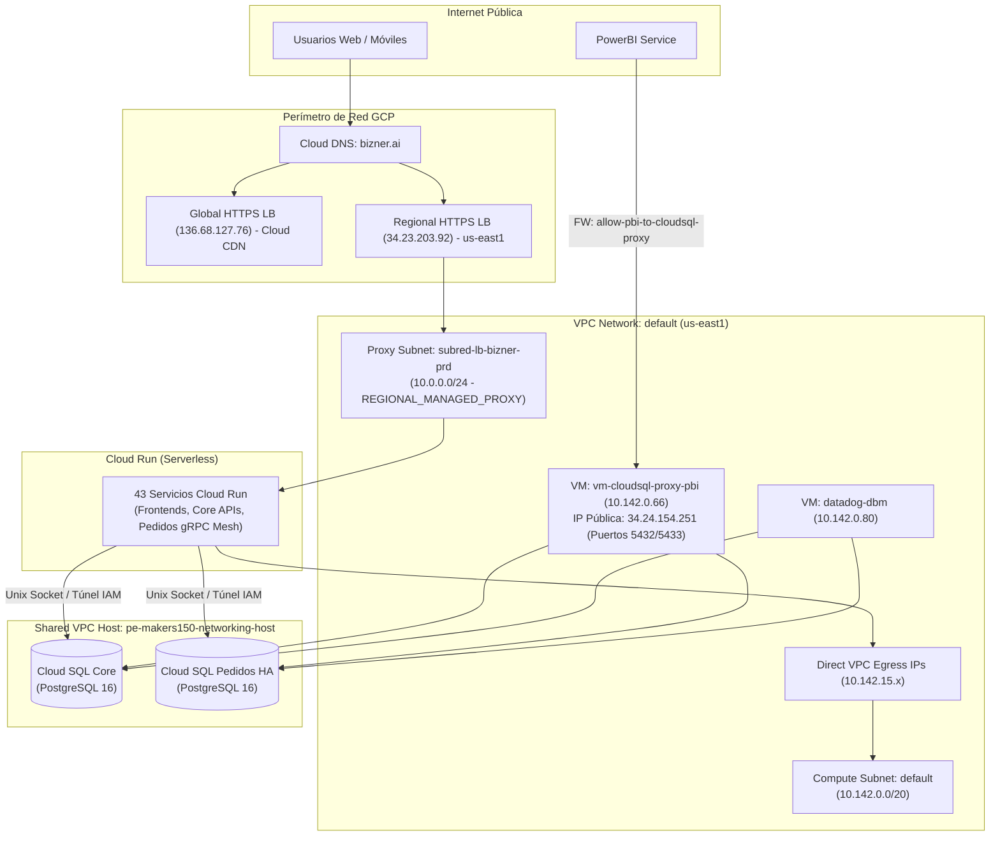
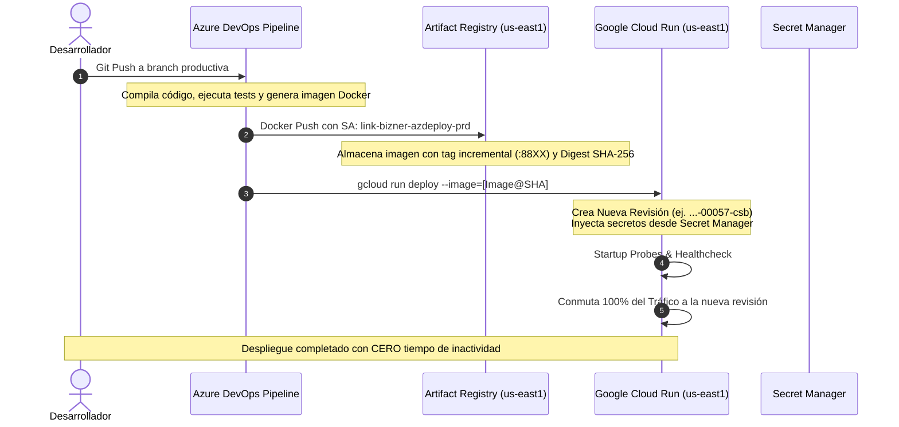
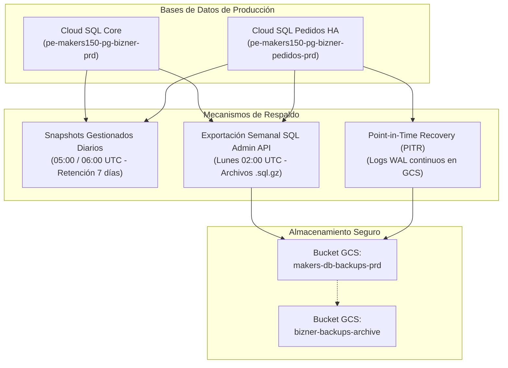

# DOCUMENTACIÓN TÉCNICA OFICIAL — BIZNER GCP PRD

```text
Proyecto: pe-makers150-prd-bizner-gcp
Ambiente: Producción (PRD)
Rol de Elaboración: Cloud Architect + DevOps/SRE + Technical Writer
Fecha de Elaboración: 27 de agosto de 2026
Estado: Documentación Definitiva Basada 100% en Datos Reales de GCP
```

---

## 1. Introducción

### 1.1. Objetivo del Documento
El presente documento constituye la **guía técnica, arquitectónica y operativa oficial** del proyecto de producción de **Bizner** en Google Cloud Platform (GCP). Su objetivo es proporcionar una referencia completa, clara y transparente sobre cómo está diseñada la infraestructura, cómo fluye la información, cómo interactúan sus microservicios y cuáles son los procedimientos de operación, seguridad, despliegue y continuidad del negocio.

### 1.2. Alcance
Esta documentación abarca la totalidad de los recursos desplegados en el proyecto `pe-makers150-prd-bizner-gcp`, incluyendo:
* Capa de entrada, DNS y balanceo de carga perimetral.
* Capa de cómputo serverless en Cloud Run (Frontends y Microservicios REST/gRPC).
* Capa de datos estructurados en Cloud SQL (PostgreSQL 16) y NoSQL (Firestore).
* Infraestructura de soporte en Compute Engine (VMs de monitoreo y BI).
* Redes, conectividad híbrida y Shared VPC.
* Políticas de seguridad, IAM, Service Accounts y gestión de secretos.
* Pipelines de CI/CD, Artifact Registry y estrategia de despliegues.
* Observabilidad, telemetría, dashboards y sistema escalonado de alertas.
* Plan de respaldos, recuperación ante desastres (DRP) e integraciones externas.

### 1.3. Descripción del Negocio y la Plataforma Bizner
**Bizner** es un ecosistema SaaS empresarial compuesto por dos grandes pilares:
1. **Bizner Core (Gestión y Facturación):** Plataforma de emisión y validación de comprobantes de pago electrónicos homologados ante la **SUNAT** (Perú), gestión de clientes, administración de cuentas por cobrar (*Cuaderno*) y control de suscripciones.
2. **Bizner Pedidos (Marketplace B2B/B2C y Distribución):** Plataforma digital orientada al abastecimiento de ferreterías, comercios y distribuidores, con gestión integral de catálogo, carritos de compra, órdenes, zonas de despacho y notificaciones en tiempo real.

---

## 2. Información General del Proyecto

| Parámetro | Valor Verificado en GCP | Explicación / Alcance | Estado |
| :--- | :--- | :--- | :--- |
| **Project ID** | `pe-makers150-prd-bizner-gcp` | Identificador único del proyecto en Google Cloud. | `VERIFICADO` |
| **Project Name** | `pe-makers150-bizner-gcp-prd` | Nombre descriptivo del entorno. | `VERIFICADO` |
| **Project Number** | `483597276141` | Número identificador numérico interno. | `VERIFICADO` |
| **Organización Padre** | ID `301182531400` | Vinculado a la organización raíz corporativa. | `VERIFICADO` |
| **Fecha de Creación** | `04 de enero de 2025` (`03:16:05 UTC`) | Inicio formal del aprovisionamiento en la nube. | `VERIFICADO` |
| **Región Primaria** | `us-east1` (South Carolina) | Aloja Cloud Run, Cloud SQL, VMs y Buckets principales. | `VERIFICADO` |
| **Región Secundaria** | `us-central1` (Iowa) | Cloud Functions específicas de envío de correo. | `VERIFICADO` |
| **Ámbito Global** | `global` | Cloud DNS, Cloud CDN y reglas perimetrales. | `VERIFICADO` |
| **Shared VPC Host** | `pe-makers150-networking-host` | Proyecto host corporativo de red compartida. | `VERIFICADO` |
| **Etiquetas (Labels)**| `firebase: enabled`, `firebase-core: disabled` | Habilitación para soporte de Firebase / Firestore. | `VERIFICADO` |

### 2.1. APIs y Servicios Principales Habilitados en GCP
* `run.googleapis.com` (Cloud Run Admin API)
* `sqladmin.googleapis.com` (Cloud SQL Admin API)
* `compute.googleapis.com` (Compute Engine & Networking API)
* `dns.googleapis.com` (Cloud DNS API)
* `artifactregistry.googleapis.com` (Artifact Registry API)
* `secretmanager.googleapis.com` (Secret Manager API)
* `cloudscheduler.googleapis.com` (Cloud Scheduler API)
* `pubsub.googleapis.com` / `eventarc.googleapis.com` (Pub/Sub & Eventarc API)
* `monitoring.googleapis.com` / `logging.googleapis.com` (Cloud Operations Suite)
* `firestore.googleapis.com` (Cloud Firestore API)
* `cloudfunctions.googleapis.com` (Cloud Functions API)

---

## 3. Arquitectura Global de Bizner en GCP

### 3.1. Explicación Sencilla de la Arquitectura
La infraestructura de Bizner está diseñada para ser **altamente escalable, segura y de bajo costo operativo en reposo**. 

* **Los usuarios nunca tocan los servidores directamente:** Cuando una persona ingresa a Bizner desde su navegador o teléfono, el balanceador de Google recibe la petición de forma segura.
* **Todo corre en contenedores automáticos (Serverless):** No hay servidores web encendidos gastando recursos fijos. Cada parte de la aplicación (facturar, ver productos, comprar) corre como un microservicio en Cloud Run que se enciende en milisegundos cuando hay clientes y escala según la demanda.
* **Comunicación interna ultrarrápida (gRPC):** Cuando se hace un pedido, los microservicios internos se comunican entre sí mediante un "idioma" de alta velocidad llamado gRPC sobre la red privada de Google.
* **Bases de datos protegidas y respaldadas:** Toda la información contable y de compras se almacena en bases de datos PostgreSQL de última generación (Cloud SQL), aisladas dentro de una red privada y respaldadas automáticamente a diario.

---

### 3.2. Diagrama Lógico de la Arquitectura

```mermaid
flowchart TB
    subgraph Layer_Users["1. Clientes y Canales de Acceso"]
        Web_User["Navegador Web / Clientes"]
        Mobile_App["App Móvil Android / iOS"]
        Admin_User["Operadores y Administradores"]
    end

    subgraph Layer_Edge["2. Capa Perimetral y DNS (Google Cloud)"]
        DNS["Google Cloud DNS\n(bizner.ai)"]
        LB_CDN["Global HTTPS Load Balancer\n(136.68.127.76) - Cloud CDN"]
        LB_Regional["Regional HTTPS Load Balancer\n(34.23.203.92) - us-east1\nCert: bizner-cert"]
    end

    subgraph Layer_Compute["3. Capa de Cómputo Serverless (Cloud Run - us-east1)"]
        subgraph Frontends["Frontend Single Page Applications"]
            FE_Cuaderno["bizner-cuaderno-front-prd"]
            FE_Facturador["bizner-facturador-front-prd"]
            FE_Integrador["bizner-integrador-front-prd"]
            FE_Pedidos["bizner-pedidos-ferreteria-front-prd"]
        end

        subgraph Core_APIs["Core Microservices (REST HTTP & Sockets)"]
            BE_Facturador["bizner-facturador-back-prd"]
            BE_Cuaderno["bizner-cuaderno-back-prd"]
            BE_Admin["bizner-admin-back-prd"]
            BE_Integrador["bizner-integrador-back-prd"]
            BE_Sockets["bizner-sockets-back-prd (WebSockets)"]
        end

        subgraph Pedidos_Mesh["Pedidos Microservices Mesh (gRPC Inter-service :5000)"]
            MS_Order["bizner-pedidos-njs-back-order-prd\n(8 GB RAM - minScale 1)"]
            MS_Product["bizner-pedidos-njs-back-product-prd (+grpc)"]
            MS_Cart["bizner-pedidos-njs-back-cart-prd (+grpc)"]
            MS_Customer["bizner-pedidos-njs-back-customer-prd (+grpc)"]
            MS_Auth["bizner-pedidos-njs-back-auth-prd (+grpc)"]
            MS_Other_MS["Otros 7 Microservicios gRPC\n(Zone, Store, Company, Mkt, etc.)"]
        end

        subgraph Automation_Compute["Automatización & Procesos Batch"]
            N8N["n8n-bizner (Workflow Engine)"]
            Job_RUC["Cloud Run Job: bizner-padron-ruc-prd"]
            CF_Email["Cloud Function: ext-firestore-send-email"]
        end
    end

    subgraph Layer_Data["4. Capa de Persistencia y Almacenamiento (us-east1)"]
        subgraph CloudSQL_Instances["Google Cloud SQL (PostgreSQL 16)"]
            SQL_Core[("pe-makers150-pg-bizner-prd\n(Tier: 4 vCPU, 16GB RAM - Zonal)\nDBs: db_bizner_biller, admin, book")]
            SQL_Pedidos[("pe-makers150-pg-bizner-pedidos-prd\n(Tier: 4 vCPU, 16GB RAM - Regional HA)\n14 DBs: order, product, cart, auth, n8n...")]
        end

        subgraph GCS_Buckets["Cloud Storage (GCS)"]
            GCS_Private[("bizner-bucket-private-prd\n(XMLs, PDFs, Facturas SUNAT)")]
            GCS_Public[("bizner-bucket-public-prd\n(Assets e Imágenes)")]
            GCS_CDN[("bizner-cdn-geojson-backend-prd\n(Polígonos GeoJSON)")]
            GCS_Backups[("makers-db-backups-prd\n(Respaldos Dumps SQL)")]
        end

        subgraph NoSQL_DB["NoSQL / Mensajería"]
            Firestore[("Cloud Firestore:\nbizner-mail-sender-prd")]
        end
    end

    subgraph Layer_Security_SRE["5. Seguridad, Gestión y Observabilidad"]
        SecretMgr["Secret Manager\n(45+ Secretos Cifrados)"]
        Scheduler["Cloud Scheduler\n(10 Tareas Cron de Negocio)"]
        VM_PBI["VM: vm-cloudsql-proxy-pbi\n(Túnel Cloud SQL para PowerBI)"]
        VM_DD["VM: datadog-dbm\n(Agente Datadog DBM)"]
        Monitoring["Cloud Monitoring\n(Dashboard BIZNER - GENERAL / 45+ Alertas)"]
    end

    subgraph Layer_External["6. Integraciones Externas"]
        SUNAT["SUNAT (Facturación Electrónica)"]
        CPSAA["CPSAA API (Consulta DNI/RUC)"]
        SendGrid["SendGrid (Envío Emails)"]
        PowerBI_Service["PowerBI Desktop / Service"]
        Datadog_SaaS["Datadog SaaS Platform"]
        Slack_Channels["Slack: #alertas-devops / #developers"]
    end

    %% Relaciones de Flujo
    Web_User & Mobile_App & Admin_User --> DNS
    DNS --> LB_CDN & LB_Regional
    LB_CDN --> GCS_CDN
    LB_Regional --> Frontends

    Frontends --> Core_APIs & MS_Order

    Core_APIs --> SQL_Core
    BE_Facturador --> GCS_Private & SUNAT
    BE_Integrador --> CPSAA
    BE_Admin --> SendGrid

    MS_Order <-->|gRPC :5000 Mesh| MS_Product & MS_Cart & MS_Customer & MS_Auth & MS_Other_MS
    MS_Order --> SQL_Pedidos
    MS_Other_MS --> SQL_Pedidos
    MS_Other_MS --> Firestore --> CF_Email --> SendGrid

    N8N --> SQL_Pedidos
    Job_RUC --> SQL_Core

    Scheduler --> BE_Facturador & BE_Integrador & BE_Admin & Job_RUC & SQL_Core

    PowerBI_Service --> VM_PBI --> SQL_Core & SQL_Pedidos
    VM_DD --> SQL_Core & SQL_Pedidos --> Datadog_SaaS

    Core_APIs -.-> SecretMgr
    Pedidos_Mesh -.-> SecretMgr

    Monitoring --> Slack_Channels
```



---

## 4. Inventario Consolidado de Recursos

### 4.1. Cómputo Serverless (Google Cloud Run)
Se verificaron **43 servicios Cloud Run** y **1 Cloud Run Job** en `us-east1` (salvo la extensión de email en `us-central1`):

| Nombre del Servicio | Región | CPU / RAM | Min / Max Inst. | Ingress / Conectividad | Propósito Operativo |
| :--- | :--- | :--- | :--- | :--- | :--- |
| `bizner-facturador-back-prd` | `us-east1` | 1 vCPU / 2048 MB | 0 / Auto | All / Direct VPC | Backend de Facturación Electrónica y SUNAT. |
| `bizner-facturador-front-prd` | `us-east1` | 2 vCPU / 512 MB | 0 / Auto | All / NEG Load Balancer | Frontend Web Facturador (`facturador.bizner.ai`). |
| `bizner-cuaderno-back-prd` | `us-east1` | 1 vCPU / 1024 MB | 0 / Auto | All / Direct VPC | Backend de Gestión Comercial y Libreta de Clientes. |
| `bizner-cuaderno-front-prd` | `us-east1` | 2 vCPU / 512 MB | 0 / Auto | All / NEG Load Balancer | Frontend Web Cuaderno (`cuaderno.bizner.ai`). |
| `bizner-integrador-back-prd` | `us-east1` | 1 vCPU / 1024 MB | 0 / Auto | All / Direct VPC | Backend de Mi Cuenta y Consultas DNI/RUC. |
| `bizner-integrador-front-prd` | `us-east1` | 1 vCPU / 512 MB | 0 / Auto | All / NEG Load Balancer | Frontend Web Mi Cuenta (`micuenta.bizner.ai`). |
| `bizner-admin-back-prd` | `us-east1` | 1 vCPU / 1024 MB | 0 / Auto | All / Direct VPC | Backend de Administración de Tenants y Suscripciones. |
| `bizner-sockets-back-prd` | `us-east1` | 1 vCPU / 512 MB | 0 / Auto | All / NEG Load Balancer | Servidor WebSocket para notificaciones en vivo. |
| `bizner-pedidos-njs-back-order-prd` | `us-east1` | **2 vCPU / 8192 MB** | **1 / 8** | All / Direct VPC | Orquestador principal de Compras y Pedidos B2B/B2C. |
| `bizner-pedidos-njs-back-order-prd-grpc`| `us-east1` | 1 vCPU / 1024 MB | 0 / Auto | All / Puerto 5000 | Interfaz gRPC del servicio de Pedidos. |
| `bizner-pedidos-njs-back-product-prd` | `us-east1` | 1 vCPU / 2048 MB | 0 / Auto | All / Direct VPC | Backend REST de Catálogo de Productos y Precios. |
| `bizner-pedidos-njs-back-product-prd-grpc`| `us-east1` | 2 vCPU / 4096 MB | 0 / Auto | All / Puerto 5000 | Interfaz gRPC para consultas masivas de stock. |
| `bizner-pedidos-njs-back-cart-prd` (+grpc)| `us-east1` | 1 vCPU / 2048 MB | 0 / Auto | All / Direct VPC | Gestión y persistencia de Carritos de Compra. |
| `bizner-pedidos-njs-back-customer-prd` (+grpc)| `us-east1`| 1 vCPU / 2048 MB | 0 / Auto | All / Direct VPC | Registro y datos fiscales de clientes/ferreterías. |
| `bizner-pedidos-njs-back-auth-prd` (+grpc)| `us-east1`| 1 vCPU / 2048 MB | 0 / Auto | All / Direct VPC | Emisión y validación de tokens JWT de Pedidos. |
| `bizner-pedidos-njs-back-company-prd` (+grpc)| `us-east1`| 1 vCPU / 2048 MB | 0 / Auto | All / Direct VPC | Gestión multi-empresa y distribuidores. |
| `bizner-pedidos-njs-back-store-prd` (+grpc)| `us-east1`| 1 vCPU / 2048 MB | 0 / Auto | All / Direct VPC | Sucursales, almacenes y tiendas físicas. |
| `bizner-pedidos-njs-back-zone-prd` (+grpc)| `us-east1` | 1 vCPU / 2048 MB | 0 / Auto | All / Direct VPC | Zonificación geográfica y polígonos de reparto. |
| `bizner-pedidos-njs-back-notification` (+grpc)| `us-east1`| 1 vCPU / 512 MB | 0 / Auto | All / Direct VPC | Despacho de notificaciones y alertas push. |
| `bizner-pedidos-njs-back-marketing-prd` (+grpc)| `us-east1`| 1 vCPU / 2048 MB | 0 / Auto | All / Direct VPC | Campañas, cupones y banners comerciales. |
| `bizner-pedidos-njs-back-common-data-prd` (+grpc)| `us-east1`| 2 vCPU / 4096 MB | 0 / Auto | All / Direct VPC | Parámetros maestros y tablas comunes. |
| `bizner-pedidos-njs-back-user-prd` (+grpc)| `us-east1`| 1 vCPU / 2048 MB | 0 / Auto | All / Direct VPC | Usuarios finales, perfiles y permisos de compra. |
| `bizner-pedidos-ferreteria-front-prd`| `us-east1` | 1 vCPU / 2048 MB | 0 / Auto | All / Web | Frontend SPA de pedidos para ferreterías. |
| `bizner-pedidos-admin-prd` | `us-east1` | 1 vCPU / 2048 MB | 0 / Auto | All / Web | Frontend administrativo de distribuidores. |
| `n8n-bizner` | `us-east1` | 1 vCPU / 1024 MB | 0 / 1 | All / CPU Always-On | Motor de automatización y flujos de integración. |
| `bizner-padron-ruc-prd` (Job) | `us-east1` | **2 vCPU / 8192 MB** | Batch (1 Run) | Direct VPC | Job periódico de sincronización de RUCs de SUNAT. |
| `ext-firestore-send-email-processqueue`| `us-central1`| 0.17 vCPU / 256 MB| 0 / Auto | Eventarc Trigger | Cloud Function Gen 2 para despacho de emails. |

---

### 4.2. Bases de Datos Relacionales (Google Cloud SQL)

| Instancia Cloud SQL | Motor / Versión | Región / Zona | Tier (CPU/RAM) | Disco | Alta Disponibilidad | Backups / PITR |
| :--- | :--- | :--- | :--- | :--- | :--- | :--- |
| **`pe-makers150-pg-bizner-prd`** | PostgreSQL 16 | `us-east1` (`us-east1-d`) | `db-custom-4-16384` (4 vCPU, 16 GB) | 120 GB SSD | **Zonal** (Sin failover automático) | 7 snapshots diarios (06:00 UTC) / PITR: No |
| **`pe-makers150-pg-bizner-pedidos-prd`**| PostgreSQL 16 | `us-east1` (`us-east1-d`) | `db-custom-4-16384` (4 vCPU, 16 GB) | 90 GB SSD | **Regional HA** (Con failover automático) | 7 snapshots diarios (05:00 UTC) / **PITR: Sí** |

---

### 4.3. Máquinas Virtuales (Compute Engine)

| Instancia VM | Zona | Tipo de Máquina | IP Privada | IP Pública | Función en el Ecosistema |
| :--- | :--- | :--- | :--- | :--- | :--- |
| **`datadog-dbm`** | `us-east1-c` | `e2-medium` (2 vCPU, 4 GB) | `10.142.0.80` | `34.138.134.109` | Host del agente Datadog Database Monitoring para Cloud SQL. |
| **`vm-cloudsql-proxy-pbi`** | `us-east1-d` | `e2-micro` (2 vCPU, 1 GB) | `10.142.0.66` | `34.24.154.251` | Servidor Cloud SQL Auth Proxy para conexiones de PowerBI. |
| **`workstations-...`** | `us-east1-c` | `e2-standard-4` (4 vCPU, 16 GB) | `10.142.0.39` | `34.75.24.197` | Entorno de desarrollo remoto gestionado (Cloud Workstations). |

---

### 4.4. Almacenamiento de Objetos (Cloud Storage)

| Bucket | Ubicación | Tipo de Acceso | Finalidad Principal |
| :--- | :--- | :--- | :--- |
| `bizner-bucket-private-prd` | `us-east1` | Privado (IAM) | Almacenamiento de comprobantes XML firmados, PDFs de facturación y reportes. |
| `bizner-bucket-public-prd` | `us-east1` | Público | Imágenes públicas de catálogo, logotipos y assets web. |
| `bizner-cdn-geojson-backend-prd` | `Global` | Backend Bucket | Mapas de zonificación y polígonos GeoJSON cacheados por Cloud CDN. |
| `makers-db-backups-prd` | `us-east1` | Privado (IAM) | Destino de exportaciones semanales programadas de Cloud SQL (`.sql.gz`). |
| `pe-makers150-bizner-prd-sql-backups` | `us-east1` | Privado (IAM) | Archivo histórico de respaldos y dumps de bases de datos. |
| `bizner-users-personal-data-backup` | `us-east1` | Privado (IAM) | Respaldo específico de cumplimiento de datos personales de usuarios. |
| `pe-makers150-prd-bizner-gcp.firebasestorage.app`| `us-east1` | Integrado Firebase | Storage SDK para aplicaciones móviles y adjuntos. |

---

### 4.5. Repositorios de Contenedores (Artifact Registry)

| Repositorio | Formato | Región | Descripción |
| :--- | :--- | :--- | :--- |
| **`bizner-docker-registry-prd`** | Docker | `us-east1` | Registro principal de imágenes de microservicios de producción con tags `:88XX`. |
| **`n8n-remote`** | Docker | `us-east1` | Repositorio proxy/cache local para la imagen oficial de `n8n`. |
| **`gcf-artifacts`** | Docker | `us-east1` / `us-central1` | Repositorio automático de imágenes para Cloud Functions. |

---

## 5. Fichas Técnicas de Servicios y Componentes

### 5.1. Módulo de Facturación Electrónica: `bizner-facturador-back-prd`
* **¿Qué es?** Microservicio transaccional REST en Node.js alojado en Cloud Run.
* **¿Para qué sirve?** Emite, firma digitalmente con certificado tributario, almacena y envía comprobantes de pago (facturas, boletas, notas de crédito/débito) hacia los web services de SUNAT.
* **¿Cómo funciona?**
  1. Recibe la petición HTTP desde el frontend o ERP.
  2. Valida los montos e impuestos (IGV) y genera la estructura XML bajo el estándar UBL 2.1.
  3. Firma digitalmente el XML y almacena una copia en `bizner-bucket-private-prd`.
  4. Envía el comprobante a SUNAT de forma síncrona o encolada.
  5. Recibe el CDR (Constancia de Recepción) de SUNAT y actualiza el estado en la base de datos `db_bizner_biller_prd`.
* **¿Cómo está configurado?**
  * **Región:** `us-east1` | **Recursos:** 1.0 vCPU, 2048 MB RAM.
  * **Conexión a BD:** Unix Socket `/cloudsql/pe-makers150-prd-bizner-gcp:us-east1:pe-makers150-pg-bizner-prd`.
  * **Conectividad:** Direct VPC Egress hacia la red `default`.
* **¿Con qué se relaciona?**
  * *Entrada:* Regional HTTPS Load Balancer (`34.23.203.92`) vía NEG `bizner-facturador-api`.
  * *Persistencia:* Base de datos `db_bizner_biller_prd` en Cloud SQL Core.
  * *Almacenamiento:* Bucket `bizner-bucket-private-prd`.
  * *Externos:* Web Services de SUNAT y API CPSAA.
  * *Secretos:* `FACTURADOR_APP_KEY`, `FACTURADOR_INTEGRACION_CPSAA_*`, `BIZNER_PG_*`.

---

### 5.2. Módulo Orquestador de Pedidos: `bizner-pedidos-njs-back-order-prd`
* **¿Qué es?** Microservicio de alta capacidad en Node.js que lidera el marketplace de compras B2B/B2C.
* **¿Para qué sirve?** Orquesta el flujo completo de compra: validación de usuario, cálculo de carritos, verificación de stock en almacenes, promociones, zonificación de entrega y emisión de la orden.
* **¿Cómo funciona?**
  1. Recibe la orden de compra desde el frontend (`pedidos.bizner.ai`).
  2. Valida el token JWT contra el microservicio `auth` vía gRPC.
  3. Consulta en paralelo a `product` (stock) y `customer` (límites de crédito) vía gRPC (`:5000`).
  4. Registra la transacción en la base de datos `order` dentro de Cloud SQL Pedidos HA.
  5. Escribe un evento en Firestore para disparar el correo de confirmación al comprador y distribuidor.
* **¿Cómo está configurado?**
  * **Región:** `us-east1` | **Recursos:** **2.0 vCPU, 8192 MB (8 GB) RAM**.
  * **Autoescalado:** `minScale: 1` (instancia caliente sin latencia inicial), `maxScale: 8`.
  * **Protección:** Google reCAPTCHA Enterprise activo contra bots.
* **¿Con qué se relaciona?**
  * *gRPC Clients:* Conectado a 11 microservicios `*-grpc-483597276141.us-east1.run.app:5000`.
  * *Persistencia:* Base de datos `order` en `pe-makers150-pg-bizner-pedidos-prd`.
  * *Caché:* Redis (`PEDIDOS_REDIS_HOST:6379`).
  * *Notificaciones:* Cloud Firestore (`bizner-mail-sender-prd`).

---

### 5.3. Motor de Automatización: `n8n-bizner`
* **¿Qué es?** Instancia de orquestación de flujos de trabajo (*Workflow Automation*) ejecutándose sobre Cloud Run.
* **¿Para qué sirve?** Conectar sistemas de forma automatizada, ejecutar tareas programadas, procesar webhooks de integradores y ejecutar flujos asistidos por Inteligencia Artificial.
* **¿Cómo funciona?** Mantiene un proceso activo (`cpu-throttling: false`), escucha webhooks HTTP y ejecuta nodos de integración conectados a bases de datos y APIs externas.
* **¿Cómo está configurado?**
  * **Región:** `us-east1` | **Recursos:** 1.0 vCPU, 1024 MB RAM con `startup-cpu-boost: true`.
  * **Persistencia:** Base de datos `n8n` en `pe-makers150-pg-bizner-pedidos-prd` (usuario `n8n_user`).
  * **IA:** Service Account `n8n-vertexai@...` con permisos para modelos en Vertex AI.
* **¿Con qué se relaciona?**
  * *Persistencia:* Cloud SQL Pedidos.
  * *Secretos:* `n8n-db-password`, `n8n-encryption-key`.

---

## 6. Bases de Datos (Google Cloud SQL)



### 6.1. Detalle de Configuración y Resiliencia

#### Instancia 1: `pe-makers150-pg-bizner-prd` (Core SaaS)
* **Bases de Datos Alojadas:** `db_bizner_biller_prd`, `db_bizner_admin_prd`, `db_bizner_book_prd`, `db_bizner_biller_demo_prd`, `db_bizner_book_demo_prd`.
* **Usuarios de Aplicación:** `appadm_user_bizner_prd`, `datadog`, `ro_vouchers_ctrl_bizner`, `user-datalake-mfab-prd`, `catalog_updater`.
* **Estrategia de Backup:** Snapshots automáticos diarios a las 06:00 UTC (retención de 7 días) + exportaciones programadas los lunes a Cloud Storage (`makers-db-backups-prd`).

#### Instancia 2: `pe-makers150-pg-bizner-pedidos-prd` (Pedidos Marketplace)
* **Bases de Datos Alojadas (14 DBs Segregadas):** `auth`, `cart`, `common`, `customer`, `order`, `store`, `zone`, `company`, `marketing`, `notification`, `product`, `user`, `n8n`, `postgres`.
* **Usuarios de Aplicación:** `admin_bizner_pedidos`, `appadm_user_bizner_pedidos_prd`, `n8n_user`, `usr-pbi-biznerpedidos-prd`, `usr-lake-mfab-biznerpedidos-prd`, `digou`.
* **Alta Disponibilidad:** **Regional HA**. Si la zona principal sufre una avería, Cloud SQL realiza un failover automático transparente hacia la réplica en standby sin pérdida de transacciones.
* **Point-in-Time Recovery (PITR):** **Activo**. Permite restaurar el estado de la base de datos a cualquier segundo exacto de los últimos 7 días.

---

## 7. Seguridad, IAM y Gestión de Secretos

### 7.1. Cuentas de Servicio (Service Accounts) Principales

| Service Account | Roles IAM Asignados | Función y Principio de Menor Privilegio |
| :--- | :--- | :--- |
| **`link-bizner-azdeploy-prd@...`** | • `roles/artifactregistry.admin`<br/>• `roles/run.admin`<br/>• `roles/iam.serviceAccountUser`<br/>• `roles/cloudfunctions.admin` | **Identidad del Pipeline CI/CD:** Utilizada por Azure DevOps para compilar, subir imágenes Docker a Artifact Registry y desplegar nuevas revisiones en Cloud Run sin tener acceso a datos sensibles de BD. |
| **`483597276141-compute@developer...`**| • `roles/secretmanager.secretAccessor`<br/>• `roles/cloudsql.client`<br/>• `roles/storage.objectViewer` | **Runtime Identity:** Identidad de ejecución de los microservicios Cloud Run para conectarse a Cloud SQL y extraer secretos en memoria. |
| **`sa-cloudsql-proxy-bizner@...`** | • `roles/cloudsql.client` | Identidad exclusiva de la VM `vm-cloudsql-proxy-pbi` para autenticar el túnel de PowerBI. |
| **`datadog-integration-sa@...`** | • `roles/monitoring.viewer`<br/>• `roles/logging.viewer`<br/>• `roles/cloudsql.viewer` | Identidad con privilegios de solo lectura para recolección de telemetría hacia Datadog. |
| **`sa-backup-bizner@...`** / **`sa-db-backups-central@...`** | • `roles/cloudsql.admin`<br/>• `roles/storage.objectAdmin` | Cuentas dedicadas para la ejecución de exportaciones SQL hacia Cloud Storage. |
| **`n8n-vertexai@...`** | • `roles/aiplatform.user` | Identidad para ejecución de modelos de IA en Vertex AI desde n8n. |

---

### 7.2. Gobernanza de Secretos (Google Secret Manager)
Se identificaron más de **45 secretos gestionados** clasificados en 4 categorías:

1. **Credenciales de Base de Datos:** `BIZNER_PG_USER`, `BIZNER_PG_PASSWORD`, `BIZNER_PG_HOST`, `BIZNER_PG_PORT`, `BIZNER_PG_DB_NAME_*`, `PEDIDOS_POSTGRES_*`, `n8n-db-password`.
2. **Llaves Criptográficas y de Firma:** `ADMIN_APP_KEY`, `ADMIN_ENCRYPTION_KEY`, `CUADERNO_APP_KEY`, `FACTURADOR_APP_KEY`, `INTEGRADOR_APP_KEY`, `n8n-encryption-key`.
3. **Credenciales de Integración Externa:** `ADMIN_SENDGRID_API_KEY`, `FACTURADOR_INTEGRACION_CPSAA_USER`, `FACTURADOR_INTEGRACION_CPSAA_PASSWORD`, `GOOGLE_MAPS_API_KEY`.
4. **Llaves de Servicio y Firebase:** `BIZNER_GOOGLE_APPLICATION_CREDENTIALS`, `PEDIDOS_FIREBASE_PRIVATE_KEY`, `PEDIDOS_FIREBASE_CLIENT_EMAIL`.

> [!IMPORTANT]
> Los secretos se montan dinámicamente en tiempo de ejecución (`secretKeyRef: latest`). Ninguna contraseña o API Key se encuentra escrita en código fuente ni empaquetada dentro de las imágenes Docker de Artifact Registry.

---

## 8. Networking e Infraestructura de Red



### 8.1. Componentes de Red Detallados
1. **Google Cloud DNS (`bizner-prd-zone`):** Zona pública que enruta `cuaderno.bizner.ai`, `facturador.bizner.ai`, `micuenta.bizner.ai` y `distribuidores.bizner.ai` hacia el Load Balancer Regional (`34.23.203.92`), y `cdn.bizner.ai` al Load Balancer Global (`136.68.127.76`).
2. **Subred Proxy-Only (`subred-lb-bizner-prd`):** Rango `10.0.0.0/24` en `us-east1` dedicado exclusivamente a las instancias internas del Regional Load Balancer para gestionar el tráfico hacia Serverless NEGs.
3. **Direct VPC Egress de Cloud Run:** Salida de red directa de los contenedores a la subred `10.142.0.0/20` sin necesidad de VMs intermedias de Serverless Connector.
4. **Shared VPC (`pe-makers150-vpc-network-host`):** El proyecto participa como **Service Project** conectado a la red centralizada del proyecto host `pe-makers150-networking-host`, garantizando aislamiento de base de datos y conectividad privada.
5. **Reglas de Firewall Clave:**
   * `allow-pbi-to-cloudsql-proxy`: Ingress TCP `5432`/`5433` dirigido exclusivamente a la VM `vm-cloudsql-proxy-pbi`.
   * `dd-fw-rule`: Ingress TCP `22` para administración de la VM de Datadog.

---

## 9. CI/CD, Automatización y Despliegues



### 9.1. Características del Modelo de Despliegue
* **Inmutabilidad:** Cada imagen en Artifact Registry y cada revisión en Cloud Run es inmutable y rastreable por su hash criptográfico SHA-256.
* **Despliegue Blue/Green Atómico:** El 100% del tráfico pasa a la nueva versión solo después de que el nuevo contenedor está listo y conectado a la base de datos.
* **Estrategia de Rollback Inmediato:** En caso de falla en producción, el tráfico puede ser retornado a la revisión anterior en menos de 5 segundos con el comando:
  ```bash
  gcloud run services update-traffic <SERVICE_NAME> --to-revisions=<REVISION_ESTABLE>=100 --region=us-east1
  ```

---

## 10. Observabilidad, Monitoreo y Alertamiento

### 10.1. Dashboard General de Operaciones
* **Dashboard Activo:** `BIZNER - GENERAL` (ID: `043bd476-4a2f-448b-b957-a3b213131207`)
* **Métricas Clave Desplegadas:**
  * Performance y conteo de instancias activas de Cloud Run (ventana de 3 horas).
  * Estado de salud (Up/Down) de Cloud SQL Core y Cloud SQL Pedidos.
  * Uso de disco con indicadores visuales de saturación (amarillo 75%, rojo 85%).
  * Uso de CPU al percentil 95 y memoria RAM de bases de datos.
  * Transacciones por segundo en PostgreSQL mediante consulta PromQL (`rate(cloudsql_...transaction_count)`).

### 10.2. Malla de Alertas Activas (Cloud Monitoring)
Se encuentran operativas **más de 45 políticas de alerta escalonadas**:
* **Cloud SQL:** Alertas al 70%, 80%, 90% y 100% de CPU; 70% y 85% de memoria; y saturación de conexiones PostgreSQL (100+, 150+, 200+, 250+ conexiones activas por base de datos).
* **Cloud Run:** Alertas al 80% y 99% de CPU/Memoria; concurrencia de WebSockets (>600 y >999 reqs); latencia de facturación (>4000 ms); y escalamiento máximo de instancias (2.5, 3.5 y 4.5 instancias).

### 10.3. Canales de Notificación Verificados
* **Slack:** Canal `#alertas-devops` (Equipo Makers150) y Canal `#developers` (Equipo Gestiona APP).
* **Email:** `devsecops@makers150.com`, `tl.bizner.ext@makers150.com`, `anthony.luyo.ext@makers150.com`, `diego.chavez@makers150.com`.

---

## 11. Procesos Operativos y Mantenimiento

### 11.1. Procedimiento de Rollback de un Servicio Cloud Run
1. Listar las últimas revisiones del servicio:
   ```bash
   gcloud run revisions list --service=bizner-facturador-back-prd --region=us-east1
   ```
2. Redirigir el 100% del tráfico a la revisión previa estable:
   ```bash
   gcloud run services update-traffic bizner-facturador-back-prd \
     --to-revisions=bizner-facturador-back-prd-00056-zx8=100 --region=us-east1
   ```

### 11.2. Procedimiento de Rotación de Secretos en Secret Manager
1. Añadir una nueva versión del secreto sin alterar el código:
   ```bash
   echo -n "NUEVO_VALOR_SECRETO" | gcloud secrets versions add NOMBRE_SECRETO --data-file=-
   ```
2. Reiniciar o desplegar una nueva revisión del servicio Cloud Run para que tome el valor actualizado en memoria.

---

## 12. Estrategia de Backups y Recuperación ante Desastres (DRP)



| Nivel de Protección | Mecanismo | RPO (Pérdida Máxima) | RTO (Tiempo de Recuperación) |
| :--- | :--- | :--- | :--- |
| **Transaccional (Pedidos)** | **Point-in-Time Recovery (PITR)** | **< 1 minuto** (Continuo) | 15 - 30 minutos (Hacia nueva instancia) |
| **Diario (Ambas BDs)** | **Cloud SQL Managed Snapshots** | **< 24 horas** (Diario) | 10 - 20 minutos (Restauración in-place) |
| **Histórico / Dumps** | **SQL Dumps a Cloud Storage** | **7 días** (Semanal) | 30 - 60 minutos (Importación pg_restore) |

---

## 13. Dependencias e Integraciones Externas

| Sistema / Proveedor | Protocolo / Vía | Tipo de Tráfico | Criticidad | Justificación |
| :--- | :--- | :--- | :--- | :--- |
| **SUNAT Web Services** | SOAP / REST HTTPS | Saliente (Egress) | **CRÍTICO** | Validación y autorización de comprobantes fiscales de pago. |
| **API CPSAA** (`integracion.cpsaa.com.pe`) | REST HTTPS | Saliente (Egress) | **ALTO** | Consultas en tiempo real de identidad DNI (RENIEC) y RUC (SUNAT). |
| **Google reCAPTCHA Enterprise** | REST HTTPS | Saliente (Egress) | **ALTO** | Detección y mitigación de tráfico automatizado/bots en compras. |
| **SendGrid / SMTP Gateway** | REST HTTPS / SMTP | Saliente (Egress) | **MEDIO** | Envío de correos de confirmación, facturas y recuperación de claves. |
| **Datadog SaaS** | Agente DBM (TCP 443) | Saliente (Egress) | **MEDIO** | Monitoreo APM y análisis profundo de rendimiento de base de datos. |
| **PowerBI** | TCP 5432 / 5433 | Entrante (Ingress) | **BAJO** | Extracción analítica a través de la VM `vm-cloudsql-proxy-pbi`. |
| **Azure DevOps** | API GCP (IAM / HTTPS) | Entrante (Ingress) | **MEDIO** | Ejecución de pipelines automáticos de CI/CD. |

---

## 14. Historial de Cambios y Aprovisionamiento

| Hito / Fecha | Componente | Acción Verificada |
| :--- | :--- | :--- |
| **2025-01-04** | Proyecto GCP | Creación y activación formal del proyecto `pe-makers150-prd-bizner-gcp`. |
| **2025-04-10** | Secret Manager | Carga inicial de variables de entorno y credenciales de bases de datos Core. |
| **2025-05-12** | Load Balancing | Creación del Regional HTTPS Load Balancer y URL Map `lb-frontend-bizner-prd`. |
| **2025-09-29** | Secret Manager | Carga de credenciales y secretos de bases de datos de Bizner Pedidos. |
| **2026-07-01** | Cloud CDN | Despliegue del Global CDN Load Balancer y URL Map `bizner-cdn-geojson-urlmap-prd`. |
| **2026-07-27** | n8n / Vertex AI | Despliegue del servicio `n8n-bizner` y configuración de persistencia en PostgreSQL. |
| **2026-08-20** | Cloud Run | Despliegue de revisiones activas actuales en Facturador (`00057-csb`) y Pedidos (`00054-p98`). |

---

## 15. Glosario de Términos Técnicos

* **Cloud Run:** Servicio de cómputo serverless gestionado de GCP que ejecuta contenedores HTTP/gRPC escalando de 0 a N automáticamente.
* **Cloud SQL:** Servicio de bases de datos relacionales totalmente administrado por Google para PostgreSQL, MySQL y SQL Server.
* **Direct VPC Egress:** Característica nativa moderna de Cloud Run que conecta contenedores a una VPC interna sin necesidad de aprovisionar VMs de Serverless VPC Access Connector.
* **gRPC:** Protocolo de llamadas a procedimiento remoto (RPC) de alto rendimiento basado en HTTP/2 y Protocol Buffers, utilizado para la comunicación interna entre microservicios.
* **Point-in-Time Recovery (PITR):** Capacidad de una base de datos de ser restaurada a cualquier instante específico del pasado utilizando logs transaccionales (WAL).
* **Regional HA (High Availability):** Configuración de Cloud SQL donde existe una instancia activa y una réplica sincrónica en standby en zonas distintas de la misma región para failover automático.
* **Secret Manager:** Almacén seguro de Google Cloud para cifrar, rotar y auditar el acceso a credenciales, tokens y llaves de API.
* **Serverless NEG (Network Endpoint Group):** Objeto de red en GCP que permite a un balanceador de carga HTTPS enrutar tráfico directamente hacia servicios de Cloud Run.
* **Shared VPC:** Arquitectura de red en GCP donde una organización centraliza la red VPC en un proyecto "Host" y permite que proyectos "Service" (como Bizner PRD) se conecten de forma segura.

---

---

## INFORMACIÓN PENDIENTE / REQUIERE VALIDACIÓN EXTERNA

La siguiente lista detalla los puntos que **no pueden comprobarse directamente mediante consultas CLI en este proyecto** y que requieren validación con los equipos correspondientes:

1. **Ubicación y Proveedor del Servidor Redis (`PEDIDOS_REDIS_HOST`):**
   * *Detalle:* Las variables de microservicios hacen referencia a Redis para caché y sesiones, pero no existe una instancia de Google Memorystore en este proyecto. Se debe confirmar si reside en la Shared VPC o con un proveedor externo (Redis Cloud).
2. **Definición de Pipelines YAML en Azure DevOps:**
   * *Detalle:* Confirmar con el equipo de DevOps los pasos exactos de compilación, linters, tests y aprobaciones manuales en los archivos `azure-pipelines.yml`.
3. **Plataforma del Frontend Principal (`bizner.ai` y `pedidos.bizner.ai`):**
   * *Detalle:* Los registros DNS A apuntan a la IP `35.211.193.10`. Se debe confirmar si corresponde a Firebase Hosting, Cloudflare o un proxy perimetral externo.
4. **Métricas y Dashboards en Datadog SaaS:**
   * *Detalle:* Solicitar acceso a la plataforma web de Datadog para documentar los monitores de base de datos configurados por el agente `datadog-dbm`.
5. **Configuración de Red en el Host Project (`pe-makers150-networking-host`):**
   * *Detalle:* Validar con el equipo de redes corporativo los rangos de subredes, reglas de Cloud NAT y tablas de ruteo de la Shared VPC `pe-makers150-vpc-network-host`.
