# Arquitectura Global de Bizner

Esta sección explica cómo está construido todo el ecosistema Bizner en Google Cloud. Piensa en la arquitectura como un edificio con **6 pisos**, donde cada piso tiene una función específica.

---

## 1. ¿Cómo funciona? (explicación simple)

La infraestructura de Bizner se diseñó con 4 ideas clave:

- 🛡️ **Seguridad por capas** — Los usuarios nunca interactúan directamente con los servidores o bases de datos. Todo pasa por balanceadores de carga con certificados SSL.

- ⚡ **Escalado automático** — Los servicios se ejecutan en contenedores que se multiplican cuando hay mucha demanda y se reducen cuando no, ahorrando costos.

- 🚀 **Comunicación ultrarrápida** — Los microservicios de Pedidos se comunican entre sí usando un protocolo binario de alta velocidad (gRPC), logrando respuestas en menos de 10 milisegundos.

- 💾 **Datos protegidos** — Las bases de datos viven en redes privadas aisladas, con respaldos automáticos, failover y cifrado.

---

## 2. Diagrama General

```mermaid
flowchart TB
    subgraph Layer_Users["1. Usuarios y Canales"]
        Web_User["Navegador Web"]
        Mobile_App["App Móvil"]
        Admin_User["Administradores"]
    end

    subgraph Layer_Edge["2. Entrada y DNS"]
        DNS["Cloud DNS\n(bizner.ai)"]
        LB_CDN["Balanceador Global\n+ Cloud CDN"]
        LB_Regional["Balanceador Regional\nus-east1"]
    end

    subgraph Layer_Compute["3. Servicios (Cloud Run)"]
        subgraph Frontends["Aplicaciones Web"]
            FE_Cuaderno["Cuaderno"]
            FE_Facturador["Facturador"]
            FE_Integrador["Mi Cuenta"]
            FE_Pedidos["Pedidos"]
        end

        subgraph Core_APIs["APIs Principales"]
            BE_Facturador["Facturador API"]
            BE_Cuaderno["Cuaderno API"]
            BE_Admin["Admin API"]
            BE_Integrador["Integrador API"]
            BE_Sockets["WebSockets"]
        end

        subgraph Pedidos_Mesh["Servicios de Pedidos (gRPC)"]
            MS_Order["Orquestador\n(8 GB RAM)"]
            MS_Product["Productos"]
            MS_Cart["Carritos"]
            MS_Customer["Clientes"]
            MS_Auth["Autenticación"]
            MS_Other_MS["7 servicios más"]
        end

        subgraph Automation_Compute["Automatización"]
            N8N["n8n (Flujos)"]
            Job_RUC["Job: Padrón RUC"]
            CF_Email["Envío de Emails"]
        end
    end

    subgraph Layer_Data["4. Datos y Almacenamiento"]
        subgraph CloudSQL_Instances["Bases de Datos PostgreSQL 16"]
            SQL_Core[("Core\n(Facturación, Admin, Cuaderno)")]
            SQL_Pedidos[("Pedidos\n(14 bases de datos, Alta Disponibilidad)")]
        end

        subgraph GCS_Buckets["Almacenamiento"]
            GCS_Private[("Archivos Privados\n(XMLs, PDFs, Facturas)")]
            GCS_Public[("Archivos Públicos\n(Imágenes, Assets)")]
            GCS_CDN[("CDN\n(Mapas GeoJSON)")]
            GCS_Backups[("Respaldos")]
        end

        subgraph NoSQL_DB["NoSQL"]
            Firestore[("Firestore\n(Cola de correos)")]
        end
    end

    subgraph Layer_Security_SRE["5. Seguridad y Operaciones"]
        SecretMgr["Secret Manager\n(45+ secretos)"]
        Scheduler["Tareas Programadas\n(10 cron jobs)"]
        VM_PBI["VM Proxy PowerBI"]
        VM_DD["VM Datadog"]
        Monitoring["Monitoreo\n(Dashboard + 45 alertas)"]
    end

    subgraph Layer_External["6. Servicios Externos"]
        SUNAT["SUNAT"]
        CPSAA["CPSAA (DNI/RUC)"]
        SendGrid["SendGrid (Emails)"]
        PowerBI_Service["PowerBI"]
        Datadog_SaaS["Datadog"]
        Slack_Channels["Slack"]
    end

    %% Relaciones de Flujo
    Web_User & Mobile_App & Admin_User --> DNS
    DNS --> LB_CDN & LB_Regional
    LB_CDN --> GCS_CDN
    LB_Regional --> Frontends

    Frontends --> Core_APIs & MS_Order

    Core_APIs --> SQL_Core
    BE_Facturador --> GCS_Private & SUNAT
    BE_Integrador --> CPSAA
    BE_Admin --> SendGrid

    MS_Order <-->|gRPC| MS_Product & MS_Cart & MS_Customer & MS_Auth & MS_Other_MS
    MS_Order --> SQL_Pedidos
    MS_Other_MS --> SQL_Pedidos
    MS_Other_MS --> Firestore --> CF_Email --> SendGrid

    N8N --> SQL_Pedidos
    Job_RUC --> SQL_Core

    Scheduler --> BE_Facturador & BE_Integrador & BE_Admin & Job_RUC & SQL_Core

    PowerBI_Service --> VM_PBI --> SQL_Core & SQL_Pedidos
    VM_DD --> SQL_Core & SQL_Pedidos --> Datadog_SaaS

    Core_APIs -.-> SecretMgr
    Pedidos_Mesh -.-> SecretMgr

    Monitoring --> Slack_Channels
```

---

## 3. Las 6 Capas Explicadas

### 🧑‍💻 1. Usuarios y Canales
Quiénes usan Bizner:
- **Aplicaciones Web** — Facturador, Cuaderno de Clientes, Mi Cuenta, Panel de Distribuidores
- **App Móvil** — Para dueños de ferreterías que hacen pedidos
- **Operadores internos** — Personal de soporte y administración

### 🌐 2. Capa de Entrada (DNS y Balanceadores)
El "guardia de seguridad" que recibe todo el tráfico:
- **Cloud DNS** administra el dominio `bizner.ai`
- **Balanceador Regional** (`34.23.203.92`) distribuye el tráfico web con certificado SSL
- **Balanceador Global** (`136.68.127.76`) cachea archivos estáticos pesados con CDN

### ⚡ 3. Servicios (Cloud Run)
Donde vive la lógica de negocio:
- **Frontends** — Las aplicaciones web desplegadas en Cloud Run
- **APIs Core** — Facturador, Cuaderno, Admin, Integrador y WebSockets en tiempo real
- **Pedidos (gRPC)** — 12 microservicios conectados por comunicación binaria ultrarrápida
- **Automatización** — Motor de flujos n8n, sincronización de RUCs y envío de emails

### 💾 4. Datos y Almacenamiento
Donde se guardan los datos:
- **Cloud SQL Core** — PostgreSQL 16 para facturación y suscripciones
- **Cloud SQL Pedidos** — PostgreSQL 16 con **Alta Disponibilidad** y recuperación al segundo
- **Cloud Storage** — Buckets para facturas, imágenes, mapas y respaldos
- **Firestore** — Cola de correos electrónicos

### 🔐 5. Seguridad y Operaciones
Lo que mantiene todo funcionando y protegido:
- **Secret Manager** — 45+ credenciales cifradas inyectadas en tiempo de ejecución
- **Cloud Scheduler** — Tareas automáticas de negocio (facturación, mantenimiento)
- **Máquinas Virtuales** — Para monitoreo con Datadog y reportes con PowerBI
- **Cloud Monitoring** — Dashboard centralizado con 45+ alertas

### 🔗 6. Servicios Externos
Conexiones con el mundo exterior:
- **SUNAT** para facturación electrónica
- **CPSAA / RENIEC** para validación de DNI y RUC
- **SendGrid** para envío de correos
- **PowerBI** para reportes analíticos
- **Datadog** para monitoreo avanzado
- **Slack** para alertas en tiempo real
