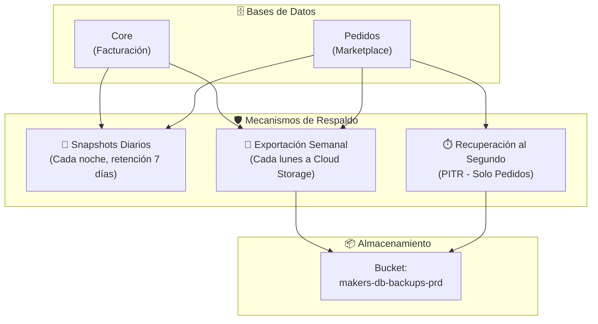

# Backups y Recuperación ante Desastres

Los datos de Bizner están protegidos por **3 capas de respaldo complementarias**. Si algo falla — un error de código, un disco que se corrompe, o un desastre mayor — hay formas de recuperar la información con pérdida mínima.

---

## 1. Las 3 Capas de Protección

---

## 2. Explicación de Cada Mecanismo

### ⏱️ Recuperación al Segundo (PITR)

- **¿Qué es?** Permite restaurar la base de datos al estado exacto de **cualquier segundo de los últimos 7 días**
- **¿Dónde aplica?** Solo en la instancia de Pedidos (la de Alta Disponibilidad)
- **¿Cuándo se usa?** Errores en scripts de migración, eliminaciones accidentales, bugs de software
- **¿Cómo funciona?** Los registros de transacciones se transmiten continuamente a Cloud Storage

### 📸 Snapshots Automáticos

- **¿Qué es?** Una "foto" completa de la base de datos tomada automáticamente cada noche
- **¿Dónde aplica?** Ambas instancias (Core y Pedidos)
- **Horario:** Pedidos a las 05:00 UTC / Core a las 06:00 UTC
- **Retención:** 7 copias diarias
- **¿Cuándo se usa?** Corrupción completa de la instancia o falla de disco

### 💾 Exportaciones Semanales

- **¿Qué es?** Un archivo `.sql.gz` comprimido y cifrado con toda la base de datos
- **¿Dónde aplica?** Ambas instancias
- **Horario:** Cada lunes a las 02:00 UTC
- **Destino:** Buckets de Cloud Storage
- **¿Cuándo se usa?** Reconstrucción en otro proyecto, migración o auditorías externas

---

## 3. ¿Cuántos datos puedo perder? (RPO y RTO)

| Nivel | Mecanismo | Pérdida máxima | Tiempo de recuperación | Escenario |
| :--- | :--- | :--- | :--- | :--- |
| 🟢 **Mejor** | PITR | **< 1 minuto** | 15-30 min | Error de código, datos borrados por accidente |
| 🟡 **Bueno** | Snapshots | **< 24 horas** | 10-20 min | Falla física de zona o corrupción de disco |
| 🟠 **Básico** | Exportaciones | **Hasta 7 días** | 30-60 min | Reconstrucción total, auditoría tributaria |

:::important Buena práctica
Siempre restaurar hacia una **instancia temporal nueva** primero, validar que los datos estén correctos, y recién entonces conmutar el tráfico productivo.
:::
