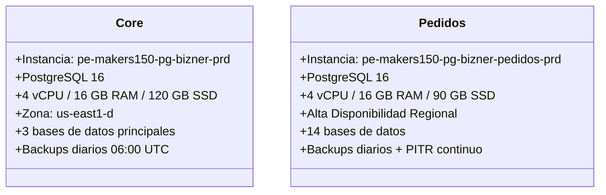

# Bases de Datos

Bizner guarda toda su información en **dos instancias de PostgreSQL 16** administradas por Google Cloud SQL. Cada una tiene una función diferente:

- 🧾 **Core** — Para facturación, administración y libreta de clientes
- 🛒 **Pedidos** — Para todo el marketplace (productos, carritos, órdenes, clientes)

La separación permite que si una tiene problemas, la otra siga funcionando sin afectarse.

---

## 1. Vista General

---

## 2. Instancia Core — Facturación y Administración

**`pe-makers150-pg-bizner-prd`**

- **Motor:** PostgreSQL 16
- **Ubicación:** `us-east1` (zona `us-east1-d`)
- **Hardware:** 4 vCPU, 16 GB RAM, 120 GB SSD
- **Tipo:** Zonal (una sola zona)
- **Red:** Conectada por red privada a la Shared VPC corporativa
- **IP Pública:** `34.138.119.78` (solo accesible desde IPs autorizadas)

### Bases de datos alojadas

| Base de datos | ¿Qué guarda? |
| :--- | :--- |
| `db_bizner_biller_prd` | Facturas electrónicas, boletas y CDRs de SUNAT |
| `db_bizner_admin_prd` | Empresas, planes de suscripción y tenants |
| `db_bizner_book_prd` | Libreta comercial de cuentas por cobrar |
| `db_bizner_biller_demo_prd` | Entorno de pruebas aislado (facturación) |
| `db_bizner_book_demo_prd` | Entorno de pruebas aislado (cuaderno) |

👤 Usuarios de base de datos

| Usuario | Función |
| :--- | :--- |
| `appadm_user_bizner_prd` | Usuario principal de los microservicios |
| `datadog` | Monitoreo de métricas de rendimiento |
| `ro_vouchers_ctrl_bizner` | Solo lectura para auditoría tributaria |
| `user-datalake-mfab-prd` | Extracción de datos hacia el lago analítico |
| `catalog_updater` | Actualización masiva de tablas maestras |

---

## 3. Instancia Pedidos — Marketplace (Alta Disponibilidad)

**`pe-makers150-pg-bizner-pedidos-prd`**

- **Motor:** PostgreSQL 16
- **Ubicación:** `us-east1` (multi-zona)
- **Hardware:** 4 vCPU, 16 GB RAM, 90 GB SSD
- **Tipo:** **Regional HA** ✅ — Si una zona cae, la base de datos conmuta automáticamente a otra zona sin perder datos
- **Recuperación al segundo (PITR):** ✅ — Puede restaurarse a cualquier segundo de los últimos 7 días

### Bases de datos alojadas (14 en total)

| Base de datos | ¿Qué guarda? |
| :--- | :--- |
| `order` | Órdenes de compra y detalle de transacciones |
| `product` | Catálogo, SKU, inventario y listas de precios |
| `cart` | Carritos de compra temporales y persistentes |
| `customer` | Clientes y líneas de crédito |
| `auth` | Credenciales, roles y tokens |
| `store` | Almacenes, sucursales y bodegas |
| `zone` | Polígonos de zonificación y fletes |
| `company` | Empresas distribuidoras y marcas |
| `marketing` | Cupones, campañas y banners |
| `notification` | Alertas y eventos push |
| `user` | Cuentas de usuario final |
| `common` | Datos maestros compartidos |
| `n8n` | Tablas internas del motor de automatización |

👤 Usuarios de base de datos

| Usuario | Función |
| :--- | :--- |
| `admin_bizner_pedidos` | Acceso administrativo |
| `appadm_user_bizner_pedidos_prd` | Usuario operativo de los microservicios |
| `n8n_user` | Acceso exclusivo para el motor de automatización |
| `usr-pbi-biznerpedidos-prd` | Lectura analítica para PowerBI |
| `usr-lake-mfab-biznerpedidos-prd` | Extracción ETL hacia el Datalake |
| `digou` | Integración externa |

---

## 4. Comparación de Resiliencia

| Característica | Core | Pedidos |
| :--- | :--- | :--- |
| **Tipo** | Zonal (1 zona) | **Regional HA (multi-zona)** ✅ |
| **Failover automático** | ❌ No | ✅ **Sí, en segundos** |
| **Recuperación al segundo (PITR)** | ❌ No | ✅ **Sí, últimos 7 días** |
| **Backups diarios** | 06:00 UTC (7 días) | 05:00 UTC (7 días) |
| **Exportación semanal** | Lunes 02:00 UTC | Lunes 02:00 UTC |
| **Pérdida máxima posible** | Hasta 24 horas | **Menos de 1 minuto** |
