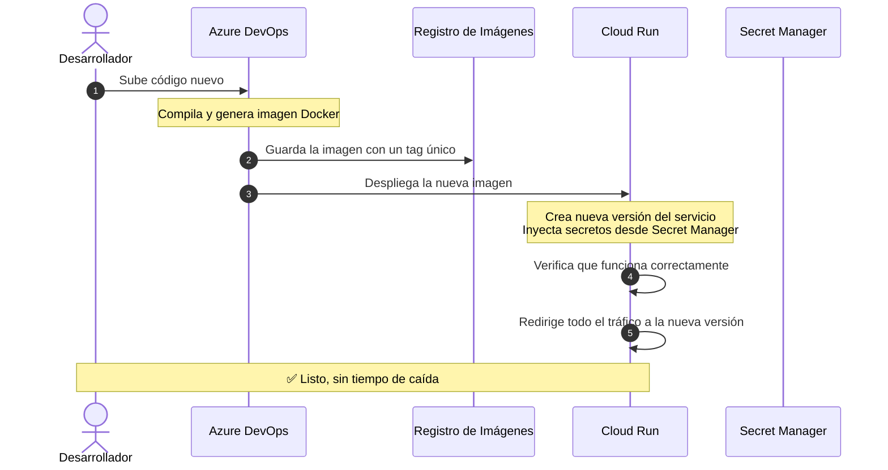

# Despliegues y Actualización de Código

Cuando un desarrollador termina una mejora o corrección, el código nuevo llega a producción de forma **automática y sin interrumpir el servicio**. Este proceso se llama CI/CD (Integración y Despliegue Continuo).

---

## 1. ¿Cómo funciona un despliegue?



---

## 2. Características del Despliegue

### 📦 Imágenes inmutables
Cada versión del código se empaqueta en una imagen Docker con un tag único (ej: `:8842`) y un hash criptográfico. Esto garantiza que lo que se probó es exactamente lo que se despliega.

### 🔄 Sin tiempo de caída (Zero-Downtime)
Cloud Run levanta los nuevos contenedores **en paralelo** a los actuales. Solo cuando la nueva versión pasa las pruebas de salud, se redirige el tráfico. Los contenedores viejos se apagan de forma ordenada.

### 🔐 Pipeline seguro
El pipeline se autentica con una identidad dedicada que **solo puede compilar y desplegar**. No tiene acceso a datos de producción ni a secretos de negocio.

---

## 3. Rollback Inmediato

Si algo sale mal después de un despliegue, se puede volver a la versión anterior en **menos de 5 segundos**, sin reconstruir nada:

```bash
# Ejemplo: volver a la versión anterior del Facturador
gcloud run services update-traffic bizner-facturador-back-prd \
  --to-revisions=bizner-facturador-back-prd-00056-zx8=100 \
  --region=us-east1
```

:::tip ¿Cómo ver las versiones disponibles?
```bash
gcloud run revisions list --service=<NOMBRE_SERVICIO> --region=us-east1
```
:::
