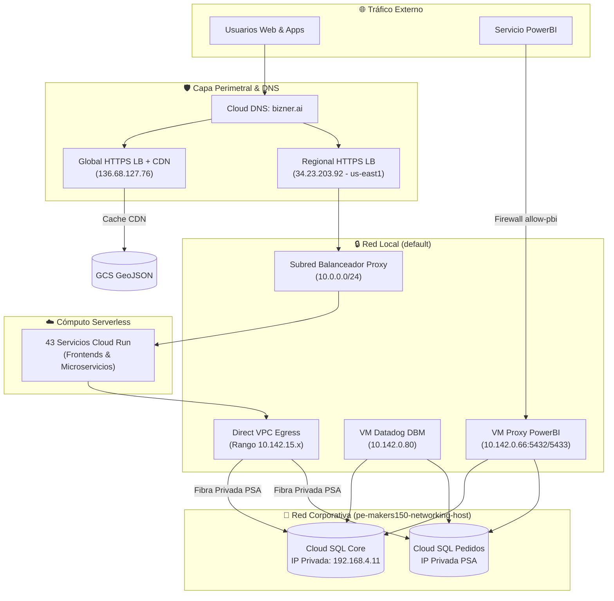

# Red e Infraestructura de Conectividad

Esta sección detalla cómo fluye el tráfico de red en Bizner: desde las peticiones de los usuarios en internet hasta la comunicación privada entre contenedores y bases de datos.

---

## 1. Topología de Red Global

---

## 2. Gestión de Dominios (Cloud DNS: `bizner.ai`)

La zona pública administrada `bizner-prd-zone` enruta el tráfico hacia las IPs correspondientes:

| Nombre de Dominio | Tipo | Destino / IP | Servicio que Responde |
| :--- | :--- | :--- | :--- |
| `facturador.bizner.ai` | A | `34.23.203.92` | Balanceador Regional → `facturador-frontend` |
| `cuaderno.bizner.ai` | A | `34.23.203.92` | Balanceador Regional → `cuaderno-frontend` |
| `micuenta.bizner.ai` | A | `34.23.203.92` | Balanceador Regional → `integrador-frontend` |
| `distribuidores.bizner.ai` | A | `34.23.203.92` | Balanceador Regional → Backend por defecto |
| `cdn.bizner.ai` | A | `136.68.127.76` | Balanceador Global + Cloud CDN (Archivos GeoJSON) |
| `pedidos.bizner.ai` | A | `35.211.193.10` | Portal web principal de Pedidos |
| `bizner.ai` | A | `35.211.193.10` | Sitio institucional principal |

---

## 3. Balanceadores de Carga y Enrutamiento

### ⚖️ Balanceador Regional HTTPS (`lb-frontend-bizner-prd`)
- **Dirección IP**: `34.23.203.92` (Región `us-east1`)
- **Certificado SSL**: Gestionado por Google (`bizner-cert`)
- **Subred Proxy Dedicada**: `10.0.0.0/24` (`subred-lb-bizner-prd`)
- **Mapa de URLs (`url-map`)**:
  - `host: facturador.bizner.ai` ➔ Backend Service `facturador-frontend`
  - `host: cuaderno.bizner.ai` ➔ Backend Service `cuaderno-frontend`
  - `host: micuenta.bizner.ai` ➔ Backend Service `integrador-frontend`

### 🌍 Balanceador Global con CDN (`bizner-cdn-geojson-urlmap-prd`)
- **Dirección IP Anycast**: `136.68.127.76`
- **Backend**: Bucket `bizner-cdn-geojson-backend-prd`
- **Función**: Almacena en caché de borde (*Edge Cache*) los polígonos y mapas vectoriales GeoJSON para que las apps móviles descarguen zonas de entrega en milisegundos.

---

## 4. Conectividad Interna: Direct VPC Egress & Shared VPC

- **Direct VPC Egress**: Todos los microservicios Cloud Run se comunican directamente con la VPC asignando interfaces de red internas (`10.142.15.x`). Esto elimina la necesidad de Serverless VPC Access Connectors tradicionales, reduciendo la latencia intra-cluster y los costos operativos de máquinas puente.
- **Shared VPC (Host Corporativo)**: El proyecto productivo `pe-makers150-prd-bizner-gcp` está conectado al host `pe-makers150-networking-host`. La comunicación hacia las bases de datos PostgreSQL viaja a través del túnel de **Private Services Access (PSA)** usando direcciones privadas (ej: `192.168.4.11`), sin transitar por internet.

---

## 5. Reglas de Firewall

| Nombre de Regla | Dirección | Puertos / Protocolo | Origen Real | Destino / Target |
| :--- | :--- | :--- | :--- | :--- |
| `allow-pbi-to-cloudsql-proxy` | INGRESS | TCP 5432, 5433 | `0.0.0.0/0` | Tag: `cloudsql-proxy-pbi` |
| `dd-fw-rule` | INGRESS | TCP 22 (SSH) | `0.0.0.0/0` | Todas las instancias |
| `default-allow-https` | INGRESS | TCP 443 | `0.0.0.0/0` | Tag: `https-server` |
| `default-allow-http` | INGRESS | TCP 80 | `0.0.0.0/0` | Tag: `http-server` |

:::warning Recomendación de Seguridad DevSecOps
La regla `allow-pbi-to-cloudsql-proxy` tiene como origen `0.0.0.0/0` protegido por la autenticación del Cloud SQL Proxy. Como buena práctica de hardening, se recomienda restringir el rango de IPs de origen exclusivamente al bloque de IPs públicas oficiales del servicio de PowerBI Service en Azure / Microsoft 365.
:::
