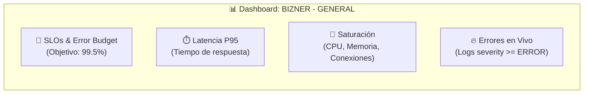
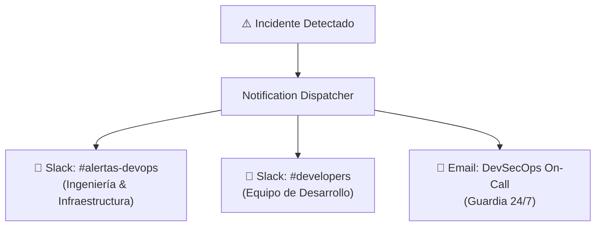

# Monitoreo y Observabilidad

El ecosistema Bizner implementa prácticas de ingeniería de confiabilidad del sitio (**SRE**) mediante **Google Cloud Monitoring** y telemetría avanzada para asegurar alta disponibilidad y rápida respuesta ante incidentes.

---

## 1. Tablero Central de Control (Dashboard "BIZNER - GENERAL")

El dashboard unificado de producción supervisa en tiempo real los cuatro pilares dorados del monitoreo:

### 🎯 Compromiso de Nivel de Servicio (SLO 99.5%)
* **SLO Objetivo**: **99.5% de peticiones exitosas** en ventanas móviles de 30 días (`bizner-availability-30d`).
* **Presupuesto de Errores (Error Budget)**: Monitoreado mediante `select_slo_budget_fraction`. Si el margen desciende hacia 0, indica riesgo de incumplimiento contractual.
* **Tasa de Quema (Burn Rate)**: Si el indicador supera el valor **`1.0`**, el sistema alerta que el presupuesto de errores se está consumiendo a una velocidad peligrosa para la ventana de tiempo.

### 📈 Métricas Clave de Cómputo y Base de Datos
- **Cloud Run**: Conteo de instancias activas por servicio, latencia P95 de arranque (*cold start*), tasa de CPU/Memoria y tiempo facturable.
- **Cloud SQL**: Conexiones activas concurrentes, operaciones de lectura/escritura en disco por segundo y tasa de transacciones por segundo (TPS).
- **Consola de Errores en Vivo**: Transmisión en tiempo real de logs con severidad `ERROR` o `CRITICAL` originados en cualquier contenedor.

---

## 2. Políticas de Alerta Activas en Producción

El proyecto cuenta con una biblioteca de ~90 políticas preconfiguradas, de las cuales **5 alertas de alta severidad están permanentemente activadas (ENABLED)** para guardia 24/7:

| Alerta Activa | Tipo de Umbral | Ventana | Severidad | Acción Requerida |
| :--- | :--- | :--- | :--- | :--- |
| **`[CRITICAL] High Error Rate 5xx > 2%`** | Tasa de errores HTTP 5xx sobre el total | 5 min | 🚨 **Crítica** | Revisar logs del microservicio afectado |
| **`[CRITICAL] Cloud SQL Connection Pool Saturation`** | Conexiones concurrentes > 160 backends | 5 min | 🚨 **Crítica** | Verificar fugas de conexión en pools |
| **`[CRITICAL] Uptime Check Failure - Integrador Back`** | Fallo en prueba de disponibilidad sintética | Inmediato | 🚨 **Crítica** | Reiniciar o escalar contenedor del Integrador |
| **`[WARNING] Latencia P95 Degradada > 2.5s`** | Percentil 95 de respuesta > 2500 ms | 10 min | ⚠️ **Alta** | Investigar cuellos de botella en consultas SQL |
| **`[WARNING] Cloud SQL High CPU Utilization > 85%`** | Uso sostenido de CPU en PostgreSQL | 10 min | ⚠️ **Alta** | Analizar queries lentas con Query Insights |

:::info Biblioteca de Políticas en Standby
Existen políticas de monitoreo granular por microservicio individual (ej: CPU > 80%, WebSockets > 600 conexiones, latencia > 4000ms) listas para ser habilitadas durante campañas de alto tráfico o ventanas promocionales.
:::

---

## 3. Canales de Notificación y Escalabilidad de Incidentes

Cuando un umbral supera los valores de guardia, el sistema despacha alertas automáticas por múltiples vías:

1. **Slack `#alertas-devops`**: Notificaciones técnicas con enlace directo al gráfico de la métrica y logs correlacionados.
2. **Slack `#developers`**: Alertas de errores de aplicación 5xx y fallas en endpoints de negocio.
3. **Correos de Guardia**: Notificaciones de escalamiento para incidentes de severidad crítica.
