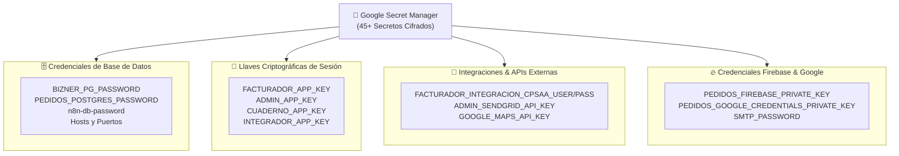

# Seguridad y Gestión de Accesos

La arquitectura de seguridad de Bizner implementa el principio de **Defensa en Profundidad** (*Defense in Depth*) bajo dos pilares estrictos:

- 🔒 **Mínimo Privilegio (PoLP)**: Cada componente de cómputo utiliza una identidad con permisos estrictamente acotados a su función operativa.
- 🚫 **Cero Secretos en Repositorio**: Ninguna contraseña, llave privada o certificado reside en código fuente ni en capas de imágenes Docker.

---

## 1. Matriz de Cuentas de Servicio (Service Accounts)

El proyecto cuenta con **12 identidades de servicio dedicadas**, segregadas según su ámbito de ejecución:

| Identidad / Email | Ámbito Operativo | Permisos y Alcance |
| :--- | :--- | :--- |
| `link-bizner-azdeploy-prd` | 🚀 **Pipeline CI/CD** | Despliegue en Cloud Run y push en Artifact Registry. **Sin acceso a datos de BD ni secretos de negocio** |
| `483597276141-compute` | ⚙️ **Runtime General** | Identidad por defecto para ejecución de contenedores y lectura de secretos autorizados |
| `link-bizner-apis-prd` | 🧾 **Runtime Core APIs** | Identidad específica para microservicios del Facturador, Cuaderno y Admin |
| `link-pedidos-apis-prd` | 🛒 **Runtime Pedidos** | Identidad para la malla gRPC y transacciones del marketplace de Pedidos |
| `sa-cloudsql-proxy-bizner` | 🔌 **Proxy PowerBI** | Exclusivo para la VM puente `vm-cloudsql-proxy-pbi` (`roles/cloudsql.client`) |
| `datadog-integration-sa` | 📊 **Monitoreo Datadog** | Lectura de métricas de rendimiento y logs de base de datos (`roles/cloudsql.viewer`) |
| `sa-db-backups-central` | 💾 **Backups Centrales** | Exportación de volcados SQL y escritura en buckets de respaldo de Cloud Storage |
| `sa-backup-bizner` | ⏰ **Scheduler Backups** | Invocación de tareas cron de respaldo desde Cloud Scheduler |
| `n8n-vertexai` | 🤖 **n8n + Inteligencia Artificial** | Invocación de modelos fundacionales en Google Vertex AI (`roles/aiplatform.user`) |
| `n8n-sheets-writer` | 📄 **n8n + Google Sheets** | Exportación automatizada de reportes hacia hojas de cálculo corporativas |
| `ext-firestore-send-email` | 📧 **Cloud Function Emails** | Lectura de documentos en Firestore y despacho transaccional vía SendGrid |
| `firebase-adminsdk-fbsvc` | 🔥 **Firebase Admin SDK** | Validación de tokens de usuarios móviles y envío de notificaciones push (FCM) |

---

## 2. Gestión de Secretos (Google Secret Manager)

Bizner administra **más de 45 secretos cifrados** con llaves administradas por Google (GMEK) y replicación automática:



### Inyección Declarativa en Tiempo de Ejecución

Los microservicios **no descargan archivos `.env` en el build**. Al iniciar el contenedor en Cloud Run, las credenciales se montan directamente en la memoria del proceso:

```yaml
# Definición declarativa en la plantilla de Cloud Run
spec:
  containers:
    - image: us-east1-docker.pkg.dev/pe-makers150-prd-bizner-gcp/bizner-docker-registry-prd/order:8842
      env:
        - name: DB_PASSWORD
          valueFrom:
            secretKeyRef:
              name: PEDIDOS_POSTGRES_PASSWORD
              version: latest
        - name: APP_KEY
          valueFrom:
            secretKeyRef:
              name: FACTURADOR_APP_KEY
              version: latest
```

:::important Rotación Segura de Credenciales
Para rotar una contraseña o API Key:
1. Se agrega una nueva versión al secreto en Secret Manager (`gcloud secrets versions add ...`).
2. Se ejecuta un nuevo despliegue o reinicio de revisión en Cloud Run.
3. Los contenedores nuevos leen la versión `latest` sin requerir cambios en el código fuente ni generar tiempo de inactividad.
:::
