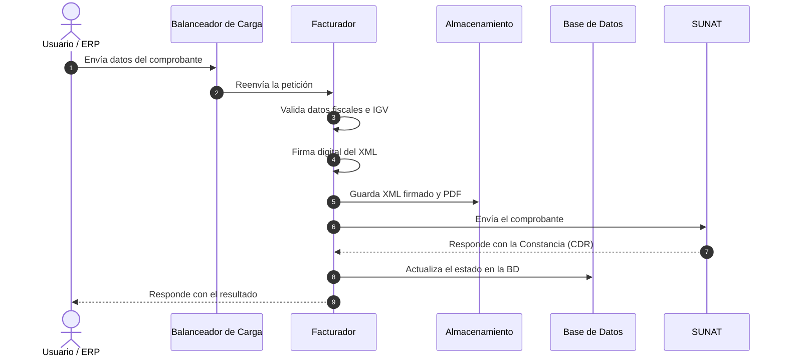

# Facturación Electrónica

El **Facturador** es el corazón tributario de Bizner. Se encarga de generar, firmar digitalmente y enviar a SUNAT todos los comprobantes de pago electrónicos: facturas, boletas, notas de crédito y guías de remisión.

:::info ¿Qué es SUNAT?
La Superintendencia Nacional de Aduanas y Administración Tributaria del Perú. Todos los comprobantes electrónicos deben estar homologados y autorizados por ellos.
:::

---

## 1. Datos del Servicio

| Dato | Valor |
| :--- | :--- |
| **Nombre** | `bizner-facturador-back-prd` |
| **Tipo** | Cloud Run (contenedor serverless) |
| **Lenguaje** | Node.js (REST API) |
| **Región** | `us-east1` |
| **Recursos** | 1 vCPU / 2 GB RAM |
| **Escalado** | De 0 a N instancias automáticamente |

---

## 2. ¿Cómo Funciona?

---

## 3. Conexiones

- **Base de datos:** `db_bizner_biller_prd` en la instancia Core
- **Almacenamiento:** XMLs firmados y PDFs en el bucket privado
- **Entrada:** Tráfico llega por el balanceador regional (`34.23.203.92`)
- **Salida:** Conectividad directa a SUNAT y a la red privada corporativa

---

## 4. Secretos que Utiliza

| Variable | ¿Qué es? |
| :--- | :--- |
| `APP_KEY` | Llave de cifrado de sesiones internas |
| `CPSAA_USER` / `CPSAA_PASSWORD` | Credenciales para consultas DNI/RUC |
| `PG_PASSWORD` | Contraseña de la base de datos |

:::warning Seguridad
Ningún certificado o secreto está en el código fuente. Todo se inyecta desde Secret Manager al momento del arranque.
:::
