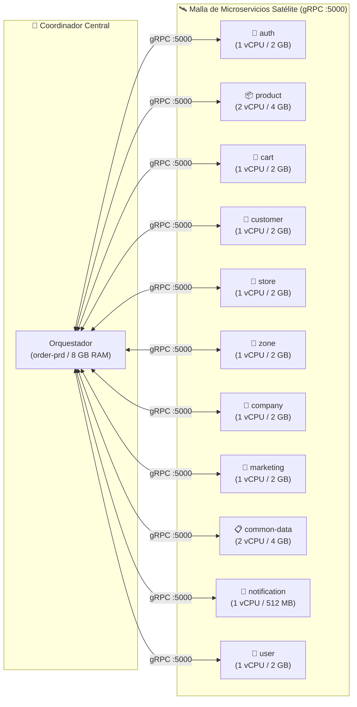

# Microservicios de Pedidos

El marketplace de **Bizner Pedidos** opera sobre una arquitectura de **11 microservicios especializados** desacoplados. Cada servicio administra su propia base de datos aislada y expone una **arquitectura dual**:

1. **Interfaz REST (HTTP)**: Para consultas externas desde aplicaciones frontend y paneles administrativos.
2. **Interfaz gRPC (Puerto `5000` - HTTP/2 binario)**: Para comunicación interna ultra-rápida entre microservicios y con el [Orquestador de Pedidos](/docs/servicios-componentes/pedidos-orquestador).

---

## 1. Topología de la Malla de Servicios

---

## 2. Catálogo Detallado por Dominio

### 📦 Productos (`product-prd`)
- **Función**: Catálogo de artículos, SKU, listas de precios mayoristas, stock por almacén y reglas de empaque.
- **Servicios Cloud Run**: `bizner-pedidos-njs-back-product-prd` (REST) / `...product-prd-grpc` (gRPC :5000).
- **Recursos**: REST (1 vCPU / 2 GB) / gRPC (2 vCPU / 4 GB para consultas masivas de catálogo).
- **Base de Datos**: `product` en Cloud SQL Pedidos.

---

### 🛒 Carritos de Compra (`cart-prd`)
- **Función**: Persistencia de carritos temporales y guardados, consolidación de cotizaciones y cálculo preliminar de totales.
- **Servicios Cloud Run**: `bizner-pedidos-njs-back-cart-prd` (REST) / `...cart-prd-grpc` (gRPC :5000).
- **Recursos**: 1 vCPU / 2 GB (REST) - 1 vCPU / 1 GB (gRPC).
- **Base de Datos**: `cart` en Cloud SQL Pedidos.

---

### 👤 Clientes Comerciales (`customer-prd`)
- **Función**: Directorio de ferreterías, validación fiscal de RUC, límites y saldos de líneas de crédito otorgadas por distribuidor.
- **Servicios Cloud Run**: `bizner-pedidos-njs-back-customer-prd` (REST) / `...customer-prd-grpc` (gRPC :5000).
- **Recursos**: 1 vCPU / 2 GB (REST) - 1 vCPU / 1 GB (gRPC).
- **Base de Datos**: `customer` en Cloud SQL Pedidos.

---

### 🔑 Autenticación y Autorización (`auth-prd`)
- **Función**: Emisión, refresco y verificación de tokens JWT, control de sesiones en dispositivos móviles y control de acceso basado en roles (RBAC).
- **Servicios Cloud Run**: `bizner-pedidos-njs-back-auth-prd` (REST) / `...auth-prd-grpc` (gRPC :5000).
- **Recursos**: 1 vCPU / 2 GB (REST) - 1 vCPU / 1 GB (gRPC).
- **Base de Datos**: `auth` en Cloud SQL Pedidos.

---

### 🏪 Almacenes y Sucursales (`store-prd`)
- **Función**: Administración de bodegas de despacho, puntos de retiro físico, horarios operativos y asignación geográfica de inventario.
- **Servicios Cloud Run**: `bizner-pedidos-njs-back-store-prd` (REST) / `...store-prd-grpc` (gRPC :5000).
- **Recursos**: 1 vCPU / 2 GB (REST) - 1 vCPU / 1 GB (gRPC).
- **Base de Datos**: `store` en Cloud SQL Pedidos.

---

### 📍 Zonificación y Cobertura (`zone-prd`)
- **Función**: Delimitación de áreas de cobertura mediante polígonos GeoJSON y cálculo dinámico de tarifas de flete según distancia.
- **Servicios Cloud Run**: `bizner-pedidos-njs-back-zone-prd` (REST) / `...zone-prd-grpc` (gRPC :5000).
- **Recursos**: 1 vCPU / 2 GB (REST) - 1 vCPU / 2 GB (gRPC).
- **Almacenamiento**: Base de datos `zone` + Bucket CDN para mapas vectoriales.

---

### 🏢 Empresas Distribuidoras (`company-prd`)
- **Función**: Configuración multi-tenant para empresas mayoristas, parametrización de marcas, pasarelas de cobro y contratos comerciales.
- **Servicios Cloud Run**: `bizner-pedidos-njs-back-company-prd` (REST) / `...company-prd-grpc` (gRPC :5000).
- **Recursos**: 1 vCPU / 2 GB (REST) - 1 vCPU / 1 GB (gRPC).
- **Base de Datos**: `company` en Cloud SQL Pedidos.

---

### 🎯 Motor de Marketing (`marketing-prd`)
- **Función**: Reglas de descuento por volumen, validación de cupones promocionales, campañas comerciales y gestión de banners publicitarios.
- **Servicios Cloud Run**: `bizner-pedidos-njs-back-marketing-prd` (REST) / `...marketing-prd-grpc` (gRPC :5000).
- **Recursos**: 1 vCPU / 2 GB (REST) - 1 vCPU / 1 GB (gRPC).
- **Base de Datos**: `marketing` en Cloud SQL Pedidos.

---

### 📋 Tablas Maestras (`common-data-prd`)
- **Función**: Repositorio central de datos comunes: departamentos, provincias, distritos (Ubigeos INEI), monedas, tipos de cambio e impuestos.
- **Servicios Cloud Run**: `bizner-pedidos-njs-back-common-data-prd` (REST) / `...common-data-prd-grpc` (gRPC :5000).
- **Recursos**: 2 vCPU / 4 GB (REST) - 1 vCPU / 2 GB (gRPC).
- **Base de Datos**: `common` en Cloud SQL Pedidos.

---

### 🔔 Notificaciones Push (`notification`)
- **Función**: Disparo de notificaciones push en tiempo real a ferreteros mediante integración con **Firebase Cloud Messaging (FCM)**.
- **Servicios Cloud Run**: `bizner-pedidos-njs-back-notification` (REST) / `...notification-grpc` (gRPC :5000).
- **Recursos**: 1 vCPU / 512 MB (REST) - 1 vCPU / 512 MB (gRPC).
- **Base de Datos**: `notification` en Cloud SQL Pedidos.

---

### 👥 Perfiles de Usuario (`user-prd`)
- **Función**: Datos personales de operadores, gestión de perfiles comerciales, historial de actividad y bitácora de auditoría.
- **Servicios Cloud Run**: `bizner-pedidos-njs-back-user-prd` (REST) / `...user-prd-grpc` (gRPC :5000).
- **Recursos**: 1 vCPU / 2 GB (REST) - 1 vCPU / 1 GB (gRPC).
- **Base de Datos**: `user` en Cloud SQL Pedidos.
