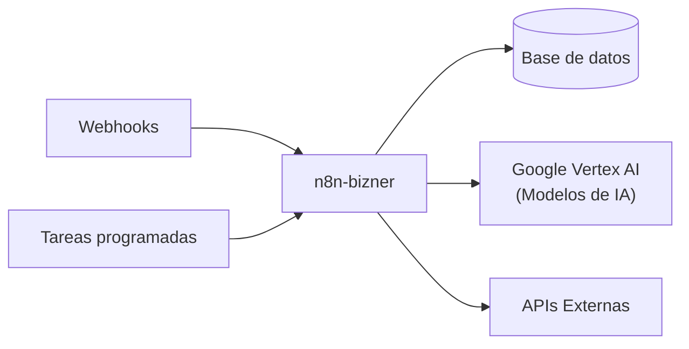

# Automatización y Procesos

Bizner tiene 3 componentes dedicados a tareas automáticas que no requieren intervención humana: un motor de flujos, un proceso de sincronización masiva y un servicio de envío de correos.

---

## 1. 🤖 Motor de Automatización (n8n)

**`n8n-bizner`** es un motor visual de automatización de flujos desplegado en Cloud Run. Permite crear integraciones y automatizaciones sin escribir código.

| Dato | Valor |
| :--- | :--- |
| **Tipo** | Cloud Run con CPU siempre activa |
| **Recursos** | 1 vCPU / 1 GB RAM |
| **Base de datos** | `n8n` en Cloud SQL Pedidos |
| **Inteligencia Artificial** | Conectado a Google Vertex AI para flujos con modelos de lenguaje |
| **Secretos** | Llaves de cifrado y contraseña de BD desde Secret Manager |

---

## 2. 📥 Sincronización del Padrón RUC

**`bizner-padron-ruc-prd`** es un proceso batch (Cloud Run Job) que descarga y procesa periódicamente el archivo masivo de contribuyentes activos de SUNAT.

| Dato | Valor |
| :--- | :--- |
| **Tipo** | Cloud Run Job (batch, no HTTP) |
| **Recursos** | 2 vCPU / 8 GB RAM |
| **¿Qué hace?** | Descarga, descomprime e indexa millones de registros tributarios |
| **Destino** | Base de datos `db_bizner_biller_prd` |
| **Disparo** | Automático vía Cloud Scheduler |

---

## 3. 📧 Envío Automático de Correos

**`ext-firestore-send-email`** es una Cloud Function que se activa automáticamente cuando un servicio necesita enviar un correo.

| Dato | Valor |
| :--- | :--- |
| **Tipo** | Cloud Function Gen 2 |
| **Región** | `us-central1` |
| **Recursos** | 0.17 vCPU / 256 MB RAM |
| **Proveedor de email** | SendGrid |

**¿Cómo funciona?**

1. Un microservicio (ej: Facturador o Pedidos) inserta un documento en Firestore con los datos del correo
2. Firestore emite un evento automático
3. La Cloud Function procesa la cola y envía el correo a través de SendGrid
4. Se registra el ID de entrega y la hora de envío
