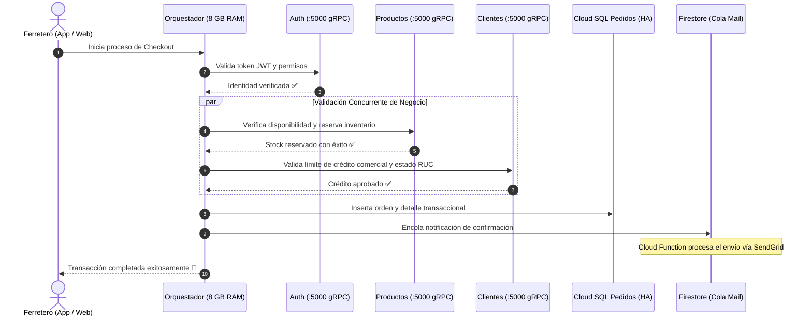

# Orquestador de Pedidos

El **Orquestador** (`bizner-pedidos-njs-back-order-prd`) es el núcleo transaccional del marketplace de Bizner Pedidos. Coordina todas las fases de una compra: autenticación del ferretero, reserva de stock, validación de líneas de crédito comercial, cálculo de fletes por zonificación y registro final de la orden.

---

## 1. Ficha Técnica del Servicio

| Parámetro | Configuración en Google Cloud |
| :--- | :--- |
| **Nombre del Servicio** | `bizner-pedidos-njs-back-order-prd` (REST) / `...order-prd-grpc` (gRPC) |
| **Tipo de Cómputo** | Cloud Run (Contenedor Serverless en `us-east1`) |
| **Asignación de Recursos** | **2 vCPU / 8 GB RAM** (Máxima capacidad asignada en el cluster) |
| **Concurrencia y Escalamiento** | Escalamiento elástico de 1 a 8 instancias concurrentes |
| **Mecanismo de Protección** | Integración con **reCAPTCHA Enterprise** para mitigación de bots y compras masivas abusivas |

:::note ¿Por qué requiere 8 GB de RAM y 2 vCPU?
El Orquestador mantiene múltiples conexiones gRPC abiertas simultáneamente con los 11 microservicios satélite durante cada transacción de compra y procesa transformaciones complejas de cotizaciones con cientos de SKUs en memoria.
:::

---

## 2. Flujo Transaccional de Compra

---

## 3. Coordinación con la Malla de Microservicios

El Orquestador no almacena catálogos ni gestiona usuarios directamente. Para cada orden, se comunica mediante **gRPC binario en puerto `5000`** con los **11 microservicios satélite** especializados:

- 🔑 **Autenticación** (`auth`) — Validación de sesiones y firmas JWT.
- 📦 **Productos** (`product`) — Disponibilidad de stock y precios mayoristas.
- 🛒 **Carritos** (`cart`) — Limpieza y consolidación del carrito activo.
- 👤 **Clientes** (`customer`) — Evaluación de riesgo y condiciones crediticias.
- 🏪 **Sucursales** (`store`) — Determinación del almacén de despacho.
- 📍 **Zonas** (`zone`) — Polígonos de reparto y tarificación de flete.
- 🏢 **Empresas** (`company`) — Reglas comerciales del distribuidor mayorista.
- 🎯 **Marketing** (`marketing`) — Aplicación de cupones y descuentos.
- 📋 **Datos Maestros** (`common-data`) — Unidades de medida y tipos de cambio.
- 🔔 **Notificaciones** (`notification`) — Despacho de alertas push móviles.
- 👥 **Usuarios** (`user`) — Registro de auditoría del comprador.

:::tip Documentación de los Microservicios Satélite
Para consultar los esquemas de bases de datos, asignación de CPU/RAM y puertos de cada microservicio, consulta la guía completa:  
👉 **[Catálogo de Microservicios de Pedidos](/docs/servicios-componentes/microservicios-pedidos)**.
:::

---

## 4. Persistencia y Almacenamiento

- **Base de Datos Principal**: Esquema `order` alojado en la instancia `pe-makers150-pg-bizner-pedidos-prd` (PostgreSQL 16 con **Alta Disponibilidad Regional y PITR**).
- **Caché en Memoria**: Redis para acelerar la validación de cotizaciones recurrentes.
- **Cola Transaccional**: Colección dedicada en Firestore para desacoplar el envío de correos y webhooks de confirmación.
